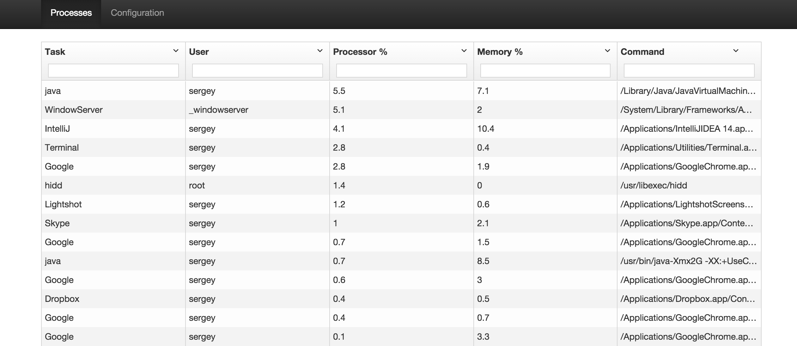
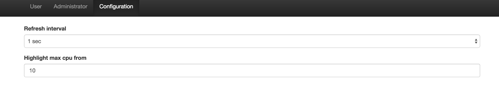

## about
Simple system activity monitor. Initially was implemented for 3 hours as test task using Scala, Spray and AngularJS.

## run
OS - OSX
To run application Node + Tomcat + JDK + Sbt must be installed.
After all installation execute in terminal following commands

#### compile web
> cd src/main/resources/web-app

> npm install

#### run server
> cd {project root}

> sbt

> container:start

Then wait till you see in terminal output `SelectChannelConnector@0.0.0.0:8080`.
Afterwards, navigate your browser to http://localhost:8080

## Screenshots

#### Processes page

#### Config page

## usage

#### filter processes by name
use `*` for search. For example to find all `Google` processes type `*Google*` in *Task* search bar of the processes grid
