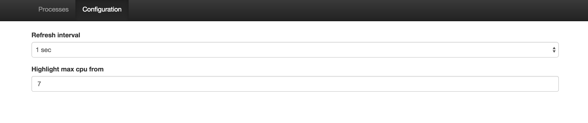

# run
OS - OSX
To run application Tomcat + Java + Scala + Sbt must me installed.
After all installation execute in terminal following commands

#### compile web
> cd src/main/resources/web-app
> npm install

#### run server
> sbt
> container:start

Then wait till you see in terminal output `SelectChannelConnector@0.0.0.0:8080`.
Afterwards, navigate your browser to http://localhost:8080

## Examples

#### Admin page (all processes)

#### User page (user processes)

#### Config page
